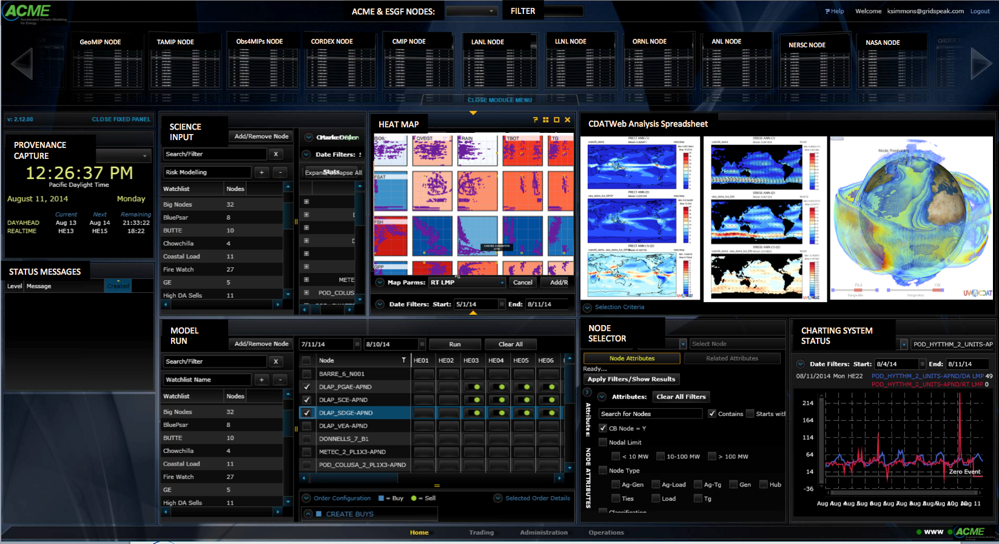

  

  

    <h2>Bootstrap</h2>
    

      Bootstrap easily and efficiently scales your websites and applications with a single code base, 
      from phones to tablets to desktops with CSS media queries. With Bootstrap, 
      you get extensive and beautiful documentation for common HTML elements, dozens of custom HTML and CSS components, 
      and awesome jQuery plugins.
    

    
<a class="btn btn-default" href="http://getbootstrap.com" role="button">View details »</a>

  
<!--/.col-xs-6.col-lg-4-->
  

    <h2>Gridster JS</h2>
    

      This is it, the mythical drag-and-drop multi-column grid has arrived. Gridster is a jQuery plugin that allows building
      intuitive draggable layouts from elements spanning multiple columns. You can even dynamically add and remove elements
      from the grid. It is on par with sliced bread, or possibly better. MIT licensed. Suitable for children of all ages.
    

    
<a class="btn btn-default" href="http://gridster.net" role="button">View details »</a>

  
<!--/.col-xs-6.col-lg-4-->
  

    <h2>Angular JS</h2>
    

      AngularJS is a toolset for building the framework most suited to your application development. 
      It is fully extensible and works well with other libraries. Every feature can be modified or 
      replaced to suit your unique development workflow and feature needs. Read on to find out how.
    

    
<a class="btn btn-default" href="https://angularjs.org" role="button">View details »</a>

  
<!--/.col-xs-6.col-lg-4-->

  

    <h2>JS Panel</h2>
    

      A jsPanel is highly configurable by a bunch of options, properties, methods and events. 
      And it's not limited to the use as a floating panel. You can further use it as modal panel, 
      as tooltip, and even as hint. Configuration options include additional toolbars for the header 
      and/or footer sections, support for right-to-left text direction, built in bootstrap support and much more.
    

    
<a class="btn btn-default" href="http://jspanel.de/index.html" role="button">View details »</a>

  
<!--/.col-xs-6.col-lg-4-->
  

    <h2>Metro JS</h2>
    

      Metro JS is a JavaScript plugin for jQuery developed to easily enable Metro interfaces on the web. 
      This release focuses on Live Tiles, the Application Bar and Theming. It's early in the development phase, 
      but all features should work on at least IE7+(Win/WinPhone), Firefox, Chrome, Android, Opera, and Safari(OSX/iOS).
    

    
<a class="btn btn-default" href="#" role="button">View details »</a>

  
<!--/.col-xs-6.col-lg-4-->
  

    <h2>JPype</h2>
    

      JPype is an effort to allow python programs full access to java class libraries. This is achieved not through re-implementing Python, 
      as Jython/JPython has done, but rather through interfacing at the native level in both Virtual Machines.
    

    
<a class="btn btn-default" href="http://jpype.sourceforge.net" role="button">View details »</a>

  
<!--/.col-xs-6.col-lg-4-->

